# AWS Resource Lifecycle Tracker – Always On Mode Setup Guide

## Prerequisites

Before you begin, ensure you have the following:

- AWS Account: An active AWS account with permissions to create resources via CloudFormation.
- EC2 Key Pair: An EC2 Key Pair in your AWS region for SSH access to the EC2 instance. (Create one in AWS Console: EC2 → Key Pairs → Create key pair) and EC2KeyPairName: The name of yourEC2 Key Pair.

### Required Parameters

- AccountId: Your 12-digit AWS Account ID.
- AlertEmail: A valid email address for alert notifications (must be confirmed via AWS email).
- DBPassword: A strong password for the RDS PostgreSQL database (8-41 chars, allowed: letters, numbers, ! # $ % ^ & * - _ = +).
- DashboardPassword: Password for the web dashboard (8-64 chars, allowed: letters, numbers, ! # $ % ^ & * - _ = + @ .).
- CloudFormation Console Access: Ability to upload and launch a stack via the AWS CloudFormation Console.

---

1 .  Download the CloudFormation Template

- Download the file: [`deploy-always-on.yaml`](https://github.com/ADITYANAIR01/AWS-Resource-lifecycle-Tracker/blob/main/CloudFormation/deploy-always-on.yaml)

2 . Upload to CloudFormation

- Go to the AWS Console → CloudFormation → Create stack → With new resources (standard).
- Upload the file you just downloaded: [`CloudFormation/deploy-always-on.yaml`](https://github.com/ADITYANAIR01/AWS-Resource-lifecycle-Tracker/blob/main/CloudFormation/deploy-always-on.yaml)

---

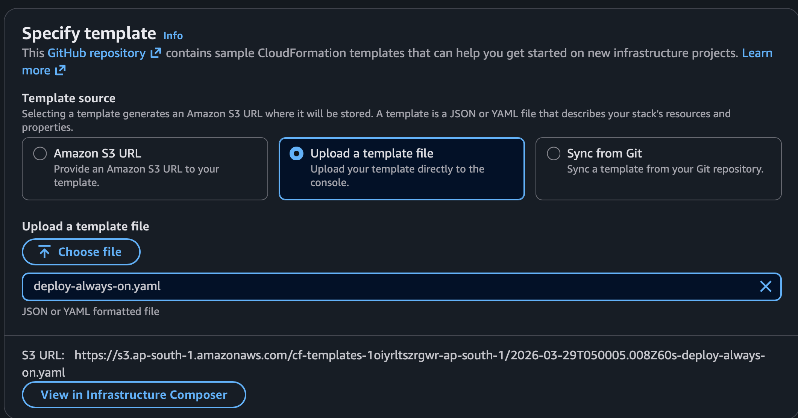

---

3 . Acknowledge and Create

- Fill in all required parameters (Account ID, Alert Email, DB Password, Dashboard Password, EC2 Key Pair Name, etc.).

- You can customize this configuration to whatever meet your frequency/configurations

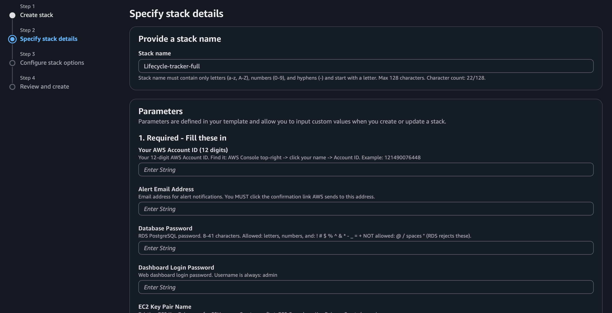
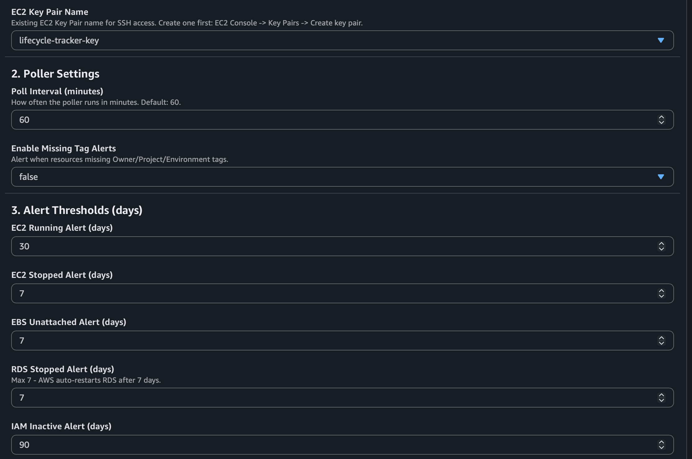
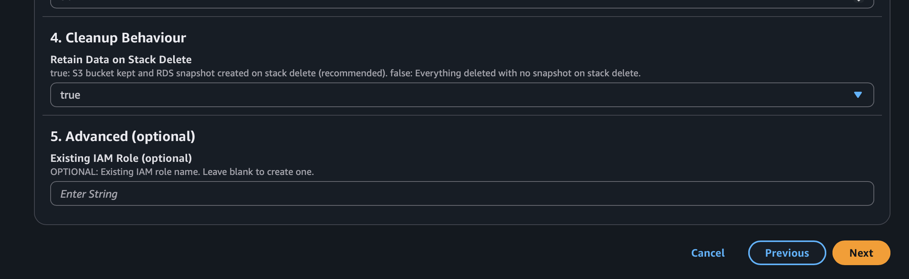

- Click next & you can choose from configuring stack options or go ahead with default and click next

---

- Acknowledge that AWS CloudFormation might create IAM resources.

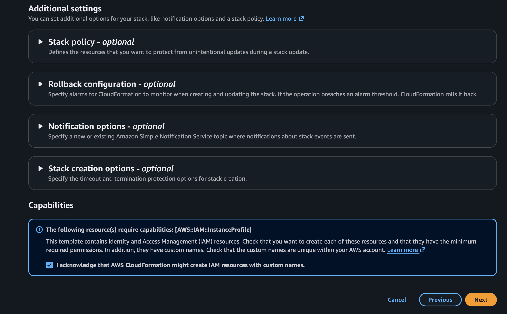

- Click Create Stack and wait for the stack to finish deploying (this may take several minutes).

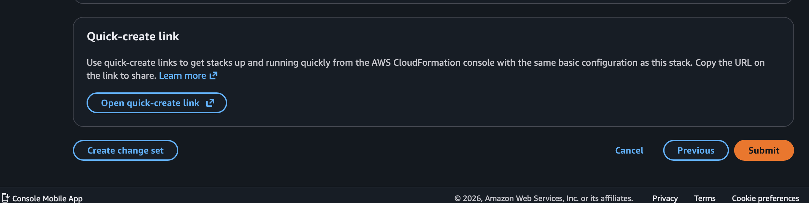

---

4 . Wait for Completion

- The stack will automatically provision all resources and set up the application. Progress can be monitored in the CloudFormation Events tab.

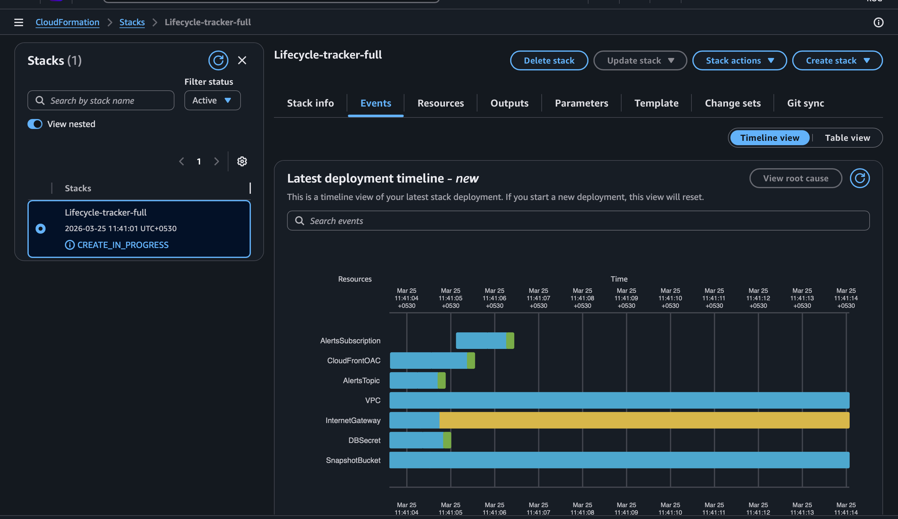

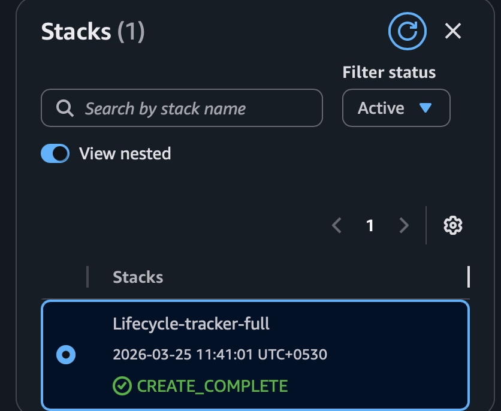

- All the list of completed resources are provided below.

---

5 . Access the Application

- Once complete, find the `DashboardURL` output in the stack’s Outputs tab.

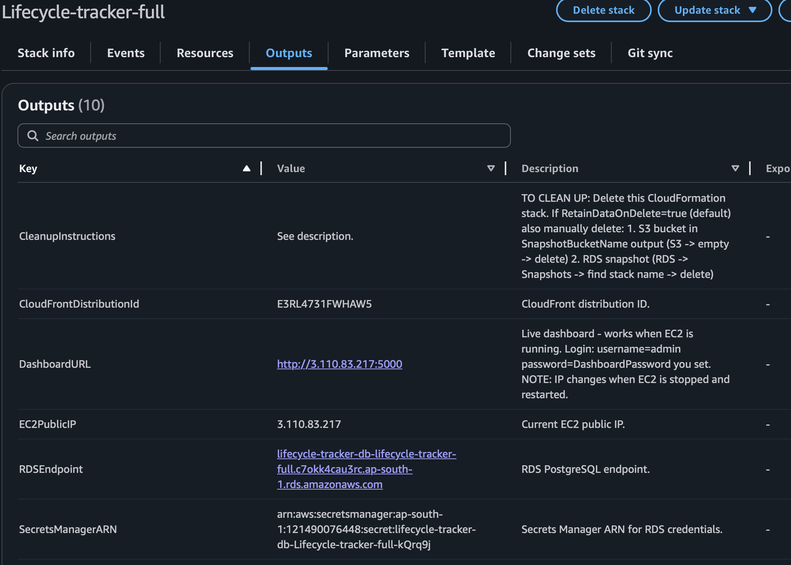

---
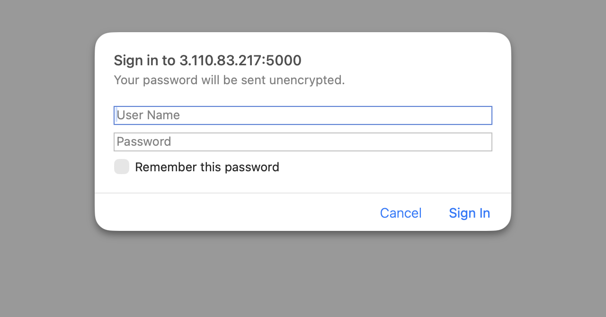

---

- Login with username: `admin` and the Dashboard Password you set.

---

6 . View Snapshots

- The `SnapshotURL` output provides a static, always-available view of your AWS resources, even if the EC2 instance is stopped.

7 . Cleanup

- To remove all resources, delete the CloudFormation stack. If you chose to retain data, manually delete the S3 bucket and RDS snapshot as described in the stack outputs.

---

## Dashboard Screeenshots

---

## Sucessfull creation of resources by CloudFormation

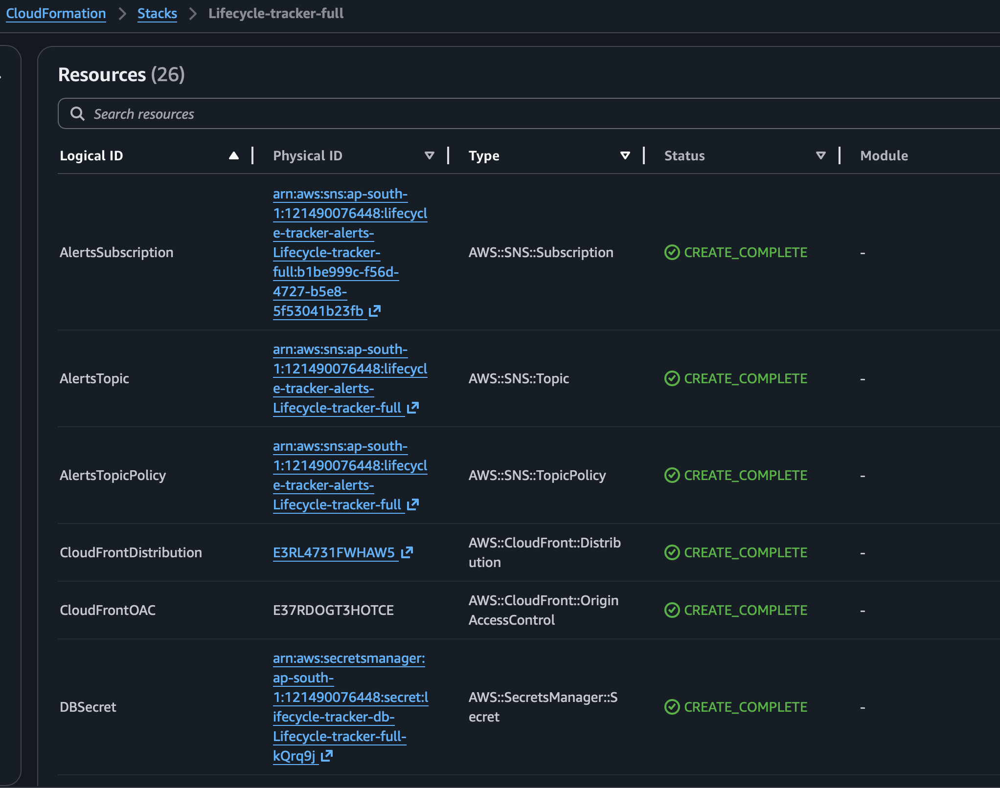
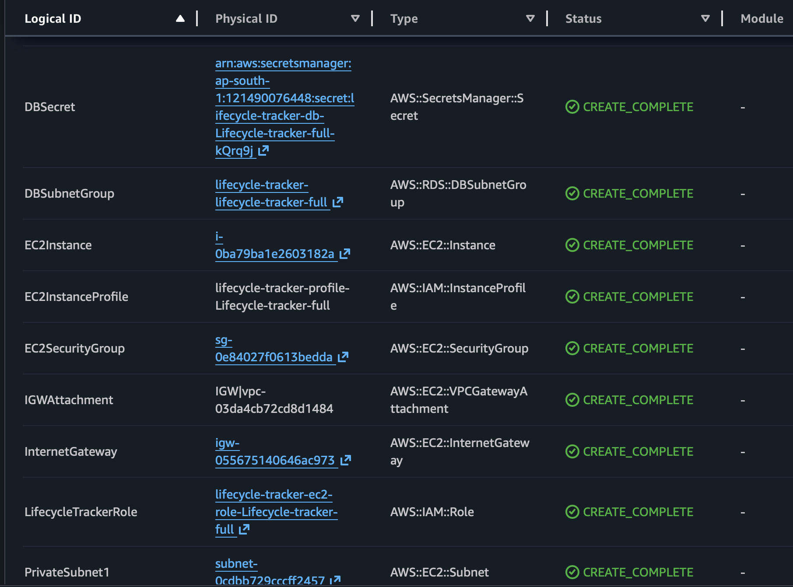
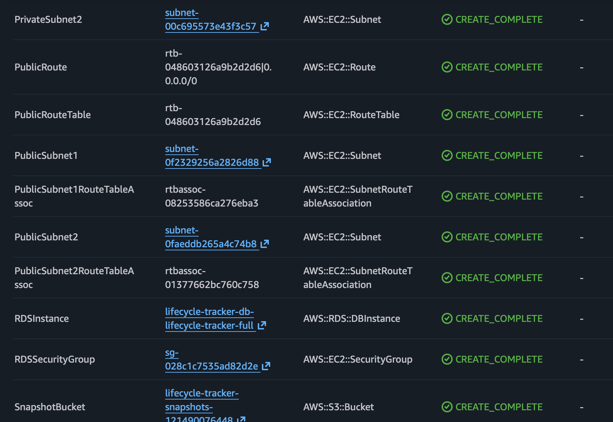
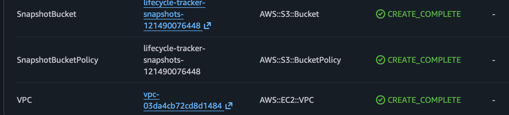

---

## 👨‍💻 Author

Aditya Nair

- GitHub: [@ADITYANAIR01](https://github.com/ADITYANAIR01)
- LinkedIn: [linkedin.com/in/adityanair001](https://www.linkedin.com/in/adityanair001)

---