# AWS Resource Lifecycle Tracker – Scheduled Mode Setup Guide

## Prerequisites

Before you begin, ensure you have the following:

- AWS Account: An active AWS account with permissions to create resources via CloudFormation.
- EC2 Key Pair: An EC2 Key Pair in your AWS region for SSH access to the EC2 instance.(Create one in AWS Console: EC2 → Key Pairs → Create key pair) and EC2KeyPairName: The name of yourEC2 Key Pair.

### Required Parameters

- AccountId: Your 12-digit AWS Account ID.
- AlertEmail: A valid email address for alert notifications (must be confirmed via AWS email).
- DBPassword: A strong password for the RDS PostgreSQL database (8-41 chars, allowed: letters, numbers, ! # $ % ^ & * - _ = +).
- DashboardPassword: Password for the web dashboard (8-64 chars, allowed: letters, numbers, ! # $ % ^ & * - _ = + @ .).
- For customizing the schedule, refer to the [Example Schedule Templates](#example-schedule-templates) section below.
- CloudFormation Console Access: Ability to upload and launch a stack via the AWS CloudFormation Console.

## Scheduled CloudFormation Deployment

1.Download the CloudFormation Template

- Download the file: [`CloudFormation/deploy-scheduled.yaml`](deploy-scheduled.yaml)

2.Upload to CloudFormation

- Go to the AWS Console → CloudFormation → Create stack → With new resources (standard).
- Upload the file you just downloaded: [`CloudFormation/deploy-scheduled.yaml`](deploy-scheduled.yaml)

---
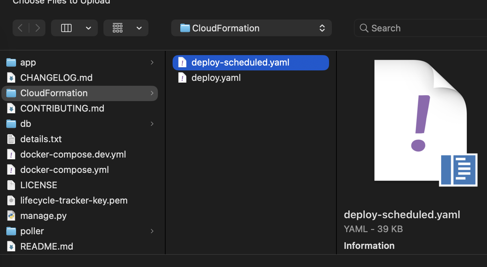

---

3.Acknowledge and Create

- Fill in all required parameters (Account ID, Alert Email, DB Password, Dashboard Password, EC2 Key Pair Name, schedule expressions, timezone, etc.).
- You can customize this configuration to whatever meet your frequency/configurations

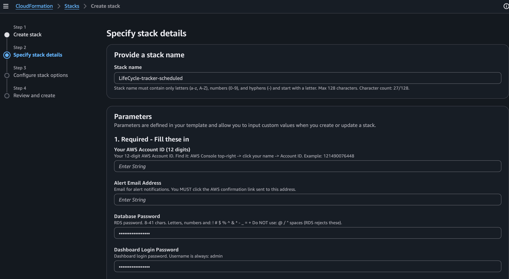
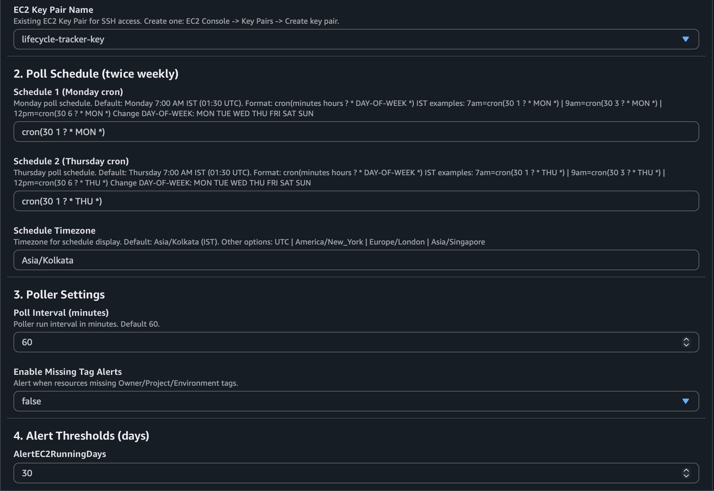
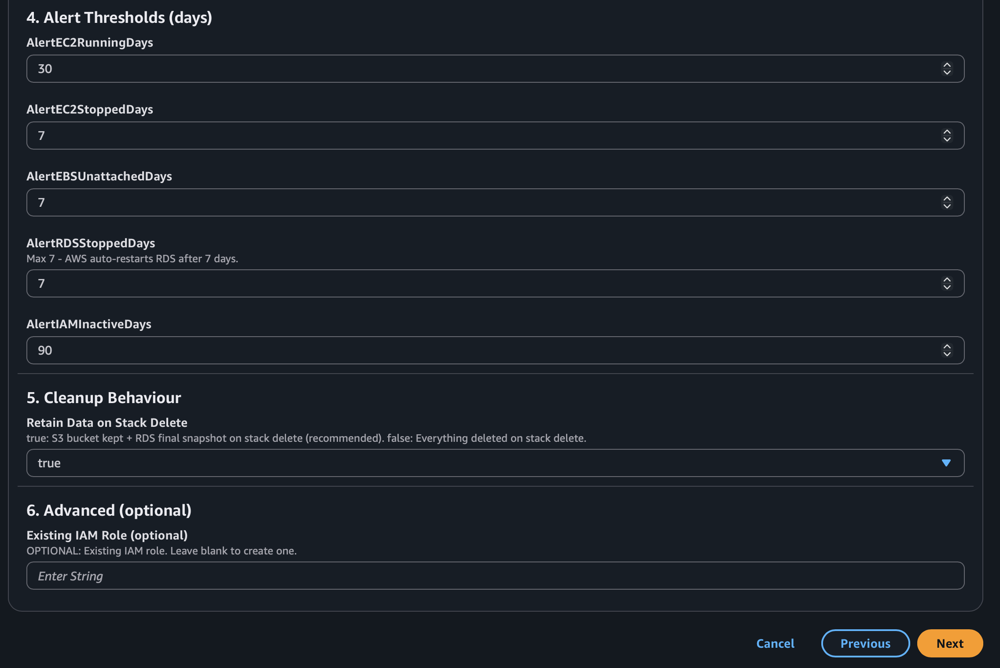

- Click next & you can choose from configuring stack options or go ahead with default and click next

---

- Acknowledge that AWS CloudFormation might create IAM resources.

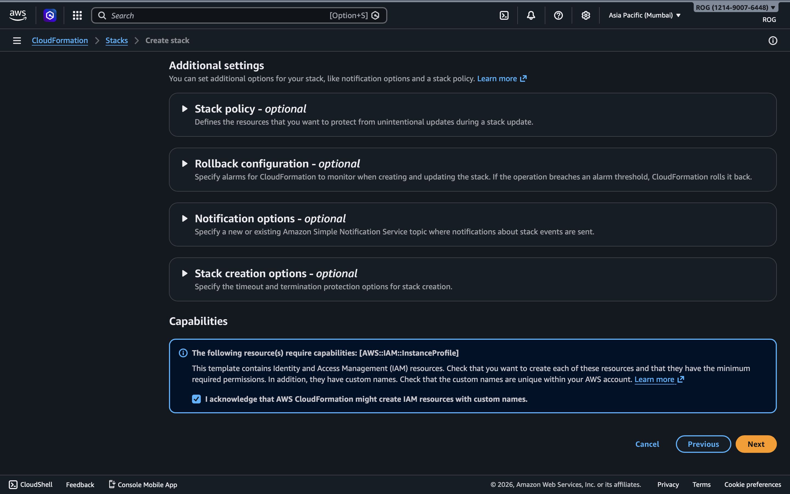

- Click Create Stack and wait for the stack to finish deploying (this may take several minutes).

---

4.Wait for Completion

- The stack will automatically provision all resources and set up the application.Progress can be monitored in the CloudFormation Events tab.

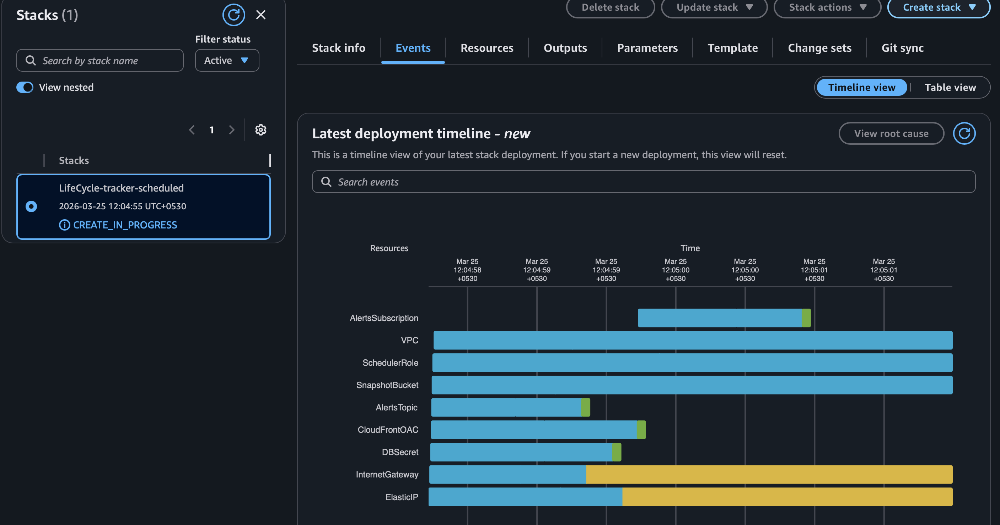

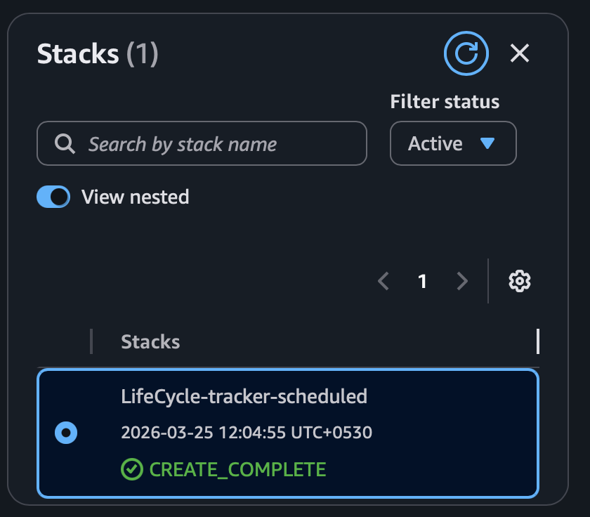

- All the list of completed resources are provided below.

---

5.How Scheduled Mode Works

- The EC2 instance and RDS database are started automatically on the schedule you set (default: Monday and Thursday mornings, IST).
- After polling and exporting a snapshot, both EC2 and RDS are automatically stopped to minimize costs.
- The dashboard is accessible only when EC2 is running.The snapshot URL is always available.
- The Elastic IP ensures the dashboard URL never changes, even after stop/start cycles.

6.Access the Application

- Once complete, find the `DashboardURL` output in the stack’s Outputs tab.
- Login with username: `admin` and the Dashboard Password you set.

7.View Snapshots

- The `SnapshotURL` output provides a static, always-available view of your AWS resources, even if the EC2 instance is stopped.

8.Cleanup

- To remove all resources, delete the CloudFormation stack.If you chose to retain data, manually delete the S3 bucket, RDS snapshot, and Elastic IP as described in the stack outputs.

---

# Example Schedule Templates

Below are some useful schedule templates (cron expressions) you can use for the scheduled deployment.Replace the default values for `ScheduleExpression1` and `ScheduleExpression2` as needed:

| Use Case                | ScheduleExpression Example         | Description                       |
|-------------------------|------------------------------------|-----------------------------------|
| Default (Mon/Thu 7am IST) | `cron(30 1 ? * MON *)` `cron(30 1 ? * THU *)` | Monday and Thursday, 7:00 AM IST  |
| Every Day 7am IST   | `cron(30 1 ? * MON-SUN *)`         | Every day, 7:00 AM IST            |
| Mon/Wed/Fri 9am IST | `cron(30 3 ? * MON *)` `cron(30 3 ? * WED *)` `cron(30 3 ? * FRI *)` | Mon, Wed, Fri, 9:00 AM IST        |
| Once a Week (Sun 8am IST) | `cron(30 2 ? * SUN *)`         | Sunday, 8:00 AM IST               |
| Every Day 8pm UTC   | `cron(0 20 ? * MON-SUN *)`         | Every day, 8:00 PM UTC            |
| Custom Timezone (New York, 6am) | `cron(0 10 ? * MON *)` `ScheduleTimezone: America/New_York` | Monday, 6:00 AM New York time     |

How to use:

- Enter your chosen cron expression(s) in the `ScheduleExpression1` and/or `ScheduleExpression2` parameter fields when launching the stack.
- Adjust the `ScheduleTimezone` parameter if you want a timezone other than the default (Asia/Kolkata).

- For more cron expression options, see the [AWS EventBridge Scheduler documentation](https://docs.aws.amazon.com/scheduler/latest/UserGuide/schedule-types.html#cron-based-schedules).

---

## Dashboard Screeenshots

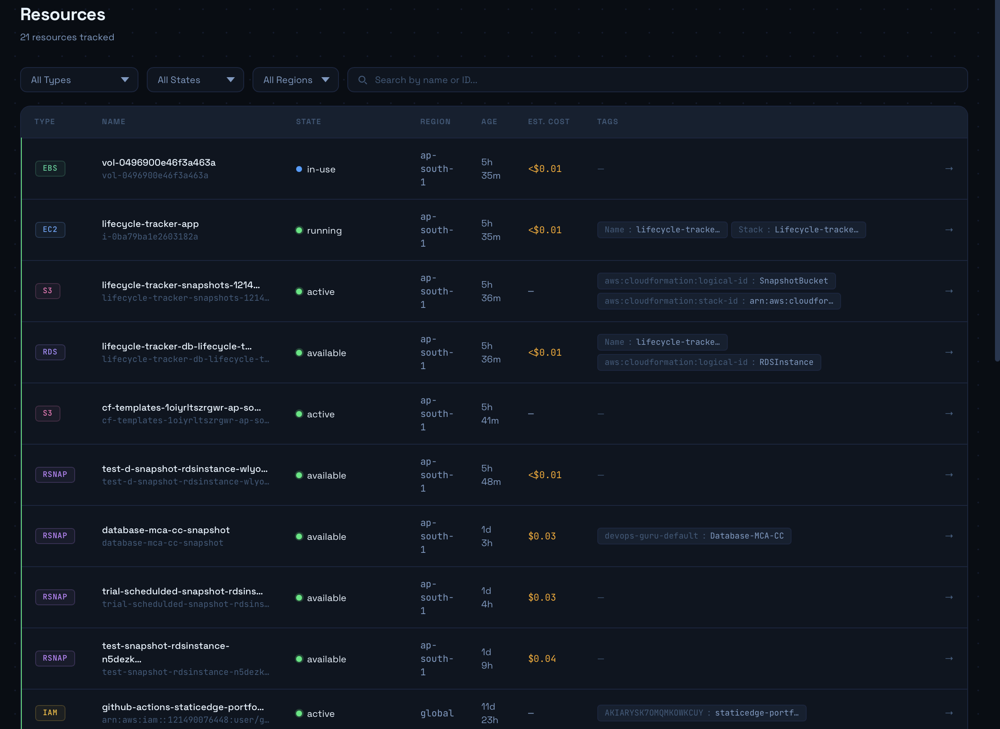
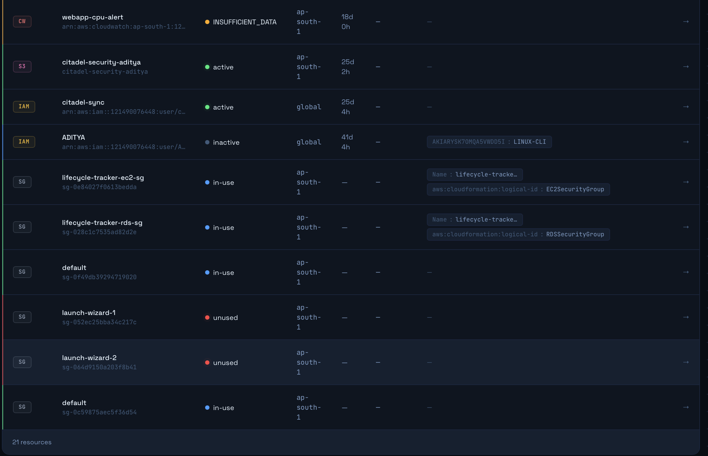
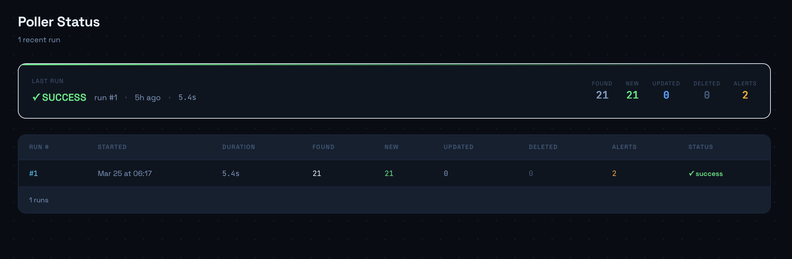

---

## Sucessfull creation of resources by CloudFormation

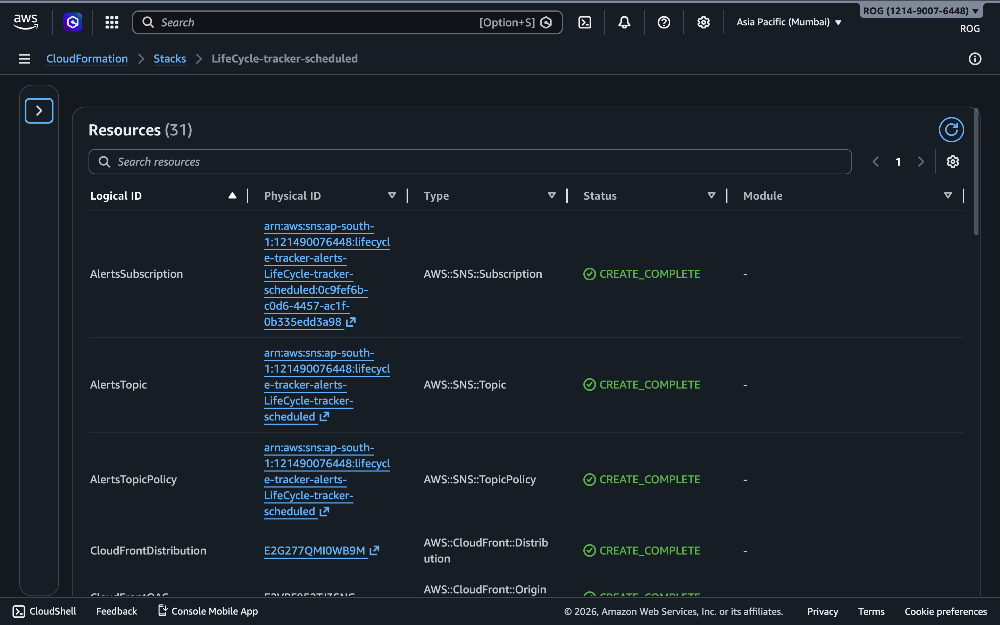
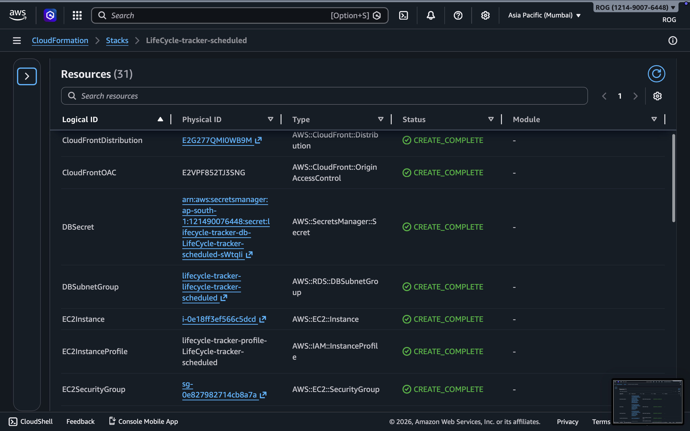
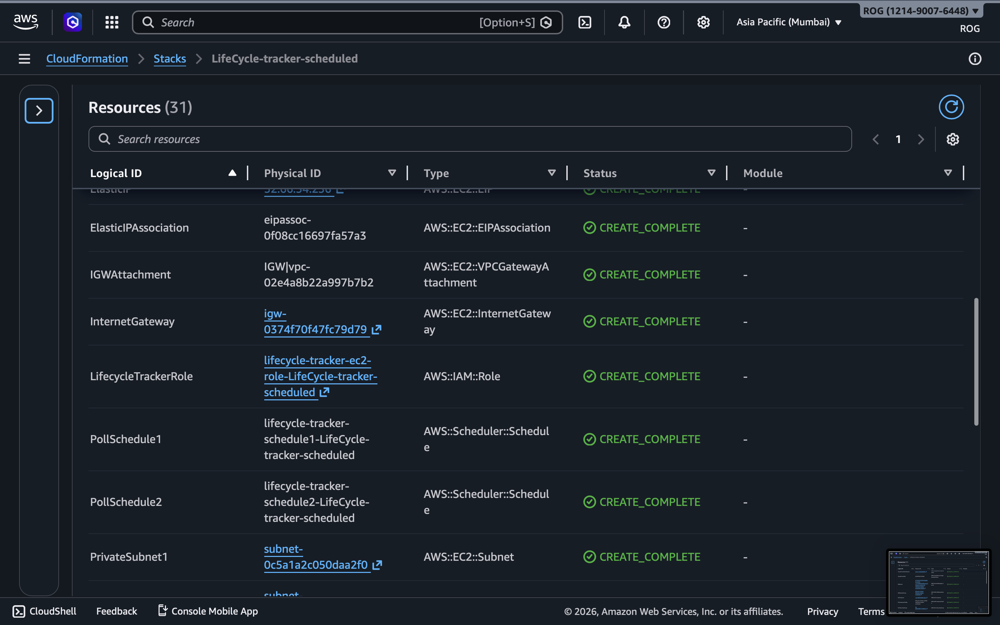
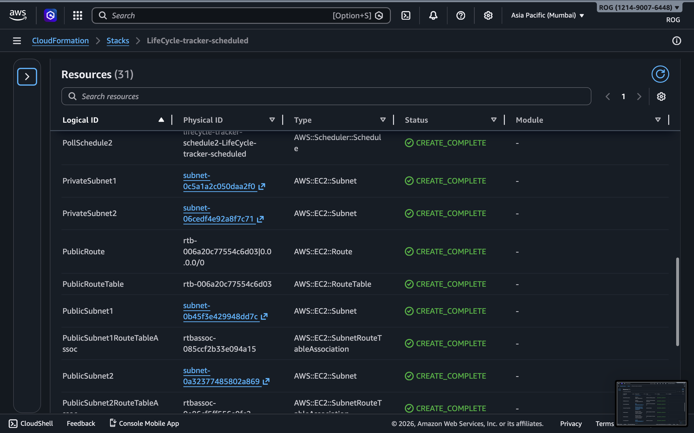
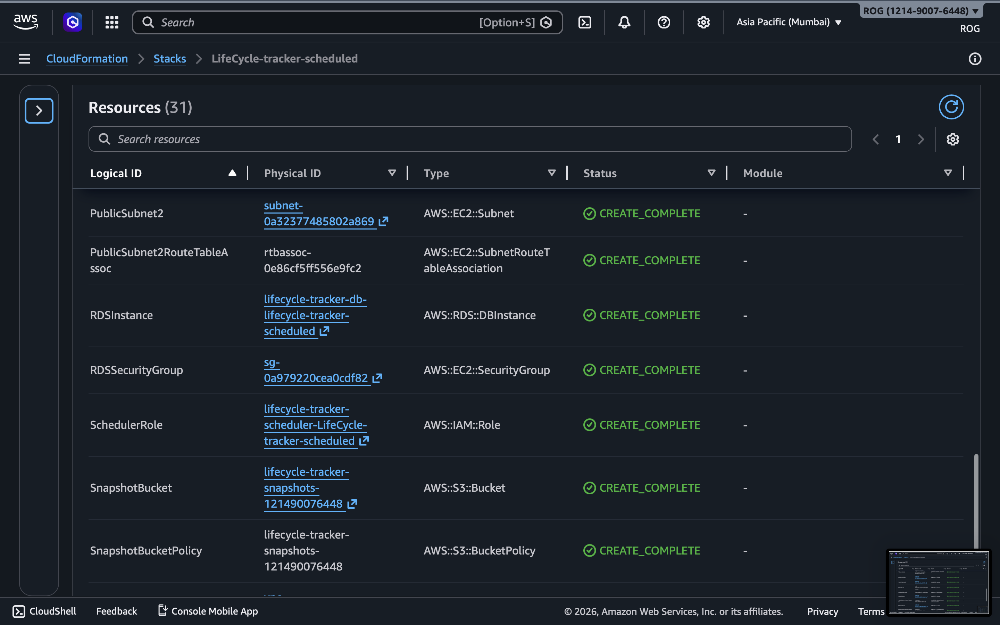
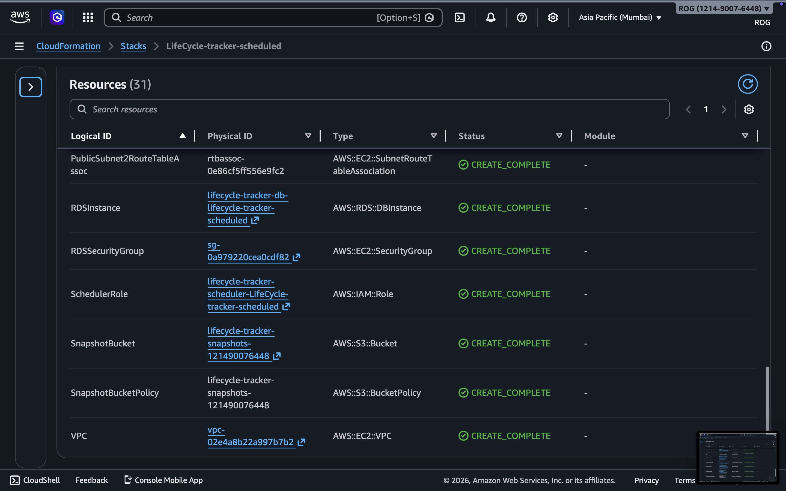

---

## 👨‍💻 Author

Aditya Nair

- GitHub: [@ADITYANAIR01](https://github.com/ADITYANAIR01)
- LinkedIn: [linkedin.com/in/adityanair001](https://www.linkedin.com/in/adityanair001)

---
