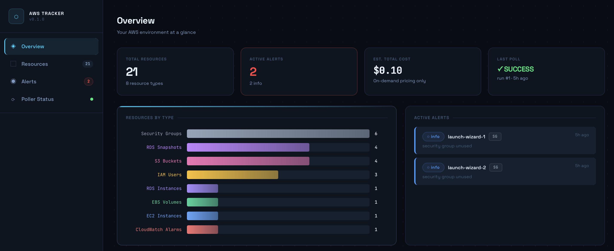

# AWS Resource Lifecycle Tracker
# Quick Links

- [CloudFormation Deployment Guides](#cloudformation-deployment)

- [Local Development](#local-development)
- [Architecture](#architecture)
- [Features](#features)
- [Contributing](#contributing)

---

## Features

- Unified dashboard for all AWS resources
- Cost tracking and resource age insights
- Automated alerts for forgotten or risky resources
- Scheduled or always-on deployment options
- Export to S3 for offline viewing
- Read-only IAM policy (safe by default)

---

## Demo



---

## Requirements

- AWS account with sufficient read-only permissions
- Docker & Docker Compose
- Python 3.8+
- (For deployment) Ability to launch CloudFormation stacks

---

> Track every AWS resource. Know what's running, what's forgotten, and what's costing you money.

**open source · Self-hosted · AWS-native · Free tier compatible.**

🌐 [tracker.adityanair.tech](https://tracker.adityanair.tech) | ⭐ Star this repo if it helps you

---

## What It Does

A self-hosted tool that monitors your AWS account and gives you a unified view of every resource — when it was created, how long it has been running, its current state, its tags, and an estimated cost. Alerts you when something looks wrong.

---

## What It Tracks

| Resource | API Used |
|---|---|
| EC2 Instances | `describe_instances` |
| EBS Volumes | `describe_volumes` |
| EBS Snapshots | `describe_snapshots` |
| RDS Instances | `describe_db_instances` |
| RDS Snapshots | `describe_db_snapshots` |
| S3 Buckets | `list_buckets` + `get_bucket_tagging` |
| Elastic IPs | `describe_addresses` |
| Security Groups | `describe_security_groups` |
| IAM Users | `list_users` + `get_access_key_last_used` |
| CloudWatch Alarms | `describe_alarms` |

---

## Architecture

```
EventBridge (scheduled)
      |
      v
  EC2 t2.micro
  +---------------------------+
  | Poller (Python + boto3)   |  --> AWS APIs (read-only)
  | Flask Dashboard           |  --> RDS PostgreSQL
  | Static Export Generator   |  --> S3 (snapshot)
  | manage.py CLI             |
  +---------------------------+
      |                |
      v                v
  RDS PostgreSQL    S3 Bucket
  (always on)       latest/     <-- viewable when EC2 is OFF
                    archive/
```

---

## CloudFormation-Deployment

You can deploy AWS Resource Lifecycle Tracker in two ways:

### Always-On Mode

- The dashboard and poller run 24/7 (higher cost, instant access).
- See the full guide: [Always-On Deployment Guide](CloudFormation/always-on-docs.md)

### Scheduled Mode (Recommended for Cost Savings)

- The dashboard and poller run only on a schedule (e.g., twice a week), then automatically stop to minimize costs. Elastic IP keeps the dashboard URL stable.
- See the full guide: [Scheduled Deployment Guide](CloudFormation/scheduled-docs.md)

---
***Both guides include step-by-step instructions, screenshots, prerequisites, and cleanup steps.***

---

## Local Development

```bash
git clone https://github.com/ADITYANAIR01/aws-resource-lifecycle-tracker
cd aws-resource-lifecycle-tracker
cp .env.example .env
# Edit .env with your values
docker compose up --build
```

Open [localhost:5000](http://localhost:5000)

Health check: http://localhost:5000/health

---

## 👨‍💻 Author
## Contributing

See [CONTRIBUTING.md](CONTRIBUTING.md) for security rules, local setup, and PR guidelines.

---

Aditya Nair

- GitHub: [@ADITYANAIR01](https://github.com/ADITYANAIR01)
- LinkedIn: [linkedin.com/in/adityanair001](https://www.linkedin.com/in/adityanair001)

### License

- [MIT LICENSE](LICENSE)

- Built by [Aditya Nair](https://www.adityanair.tech)

---